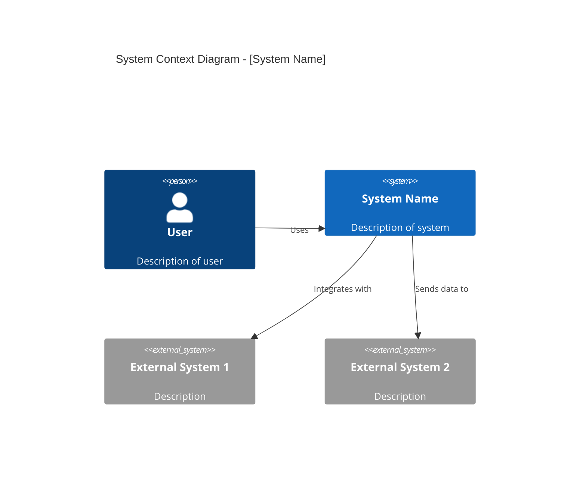
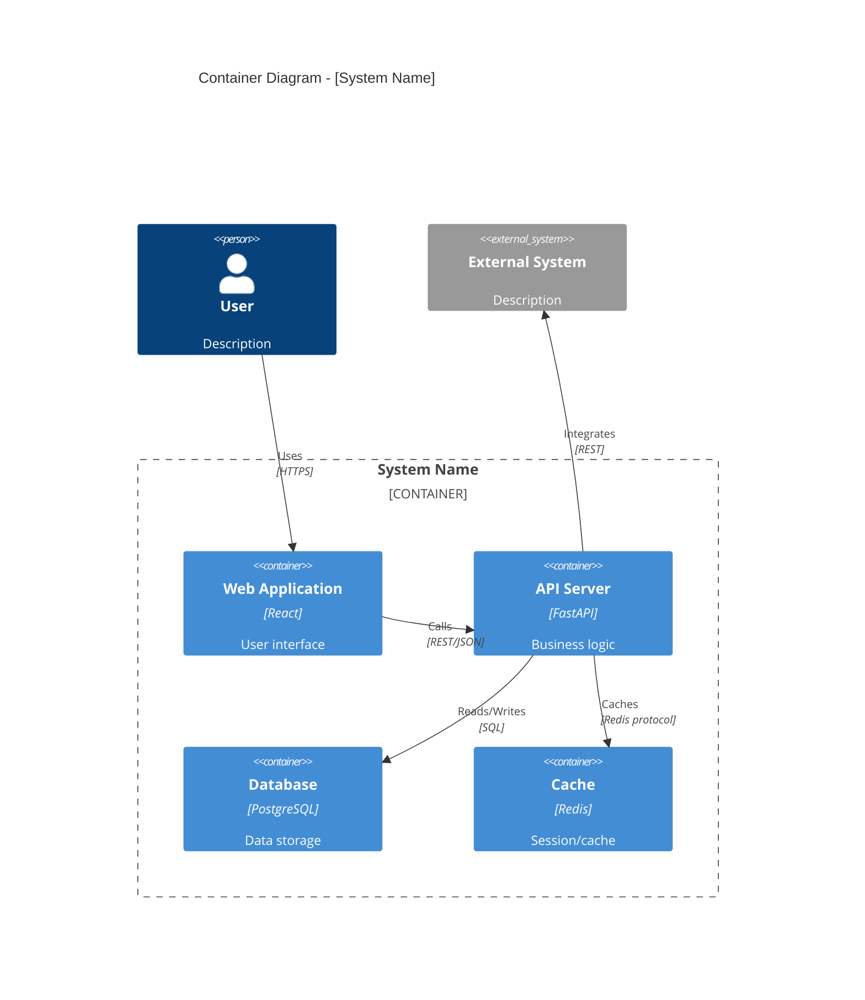
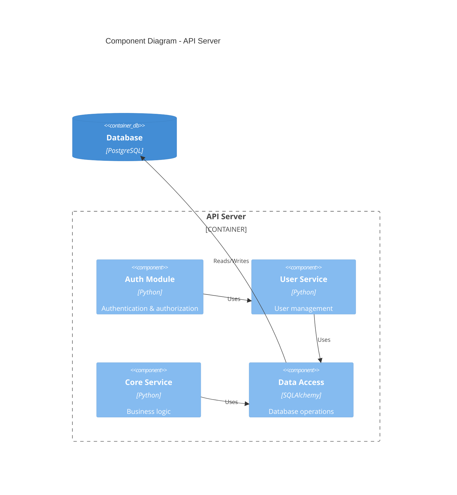
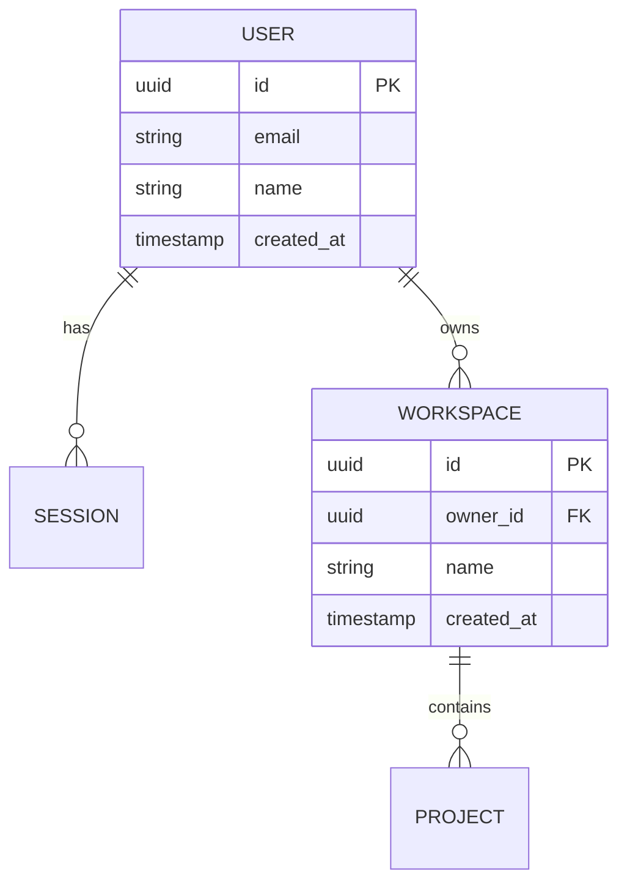
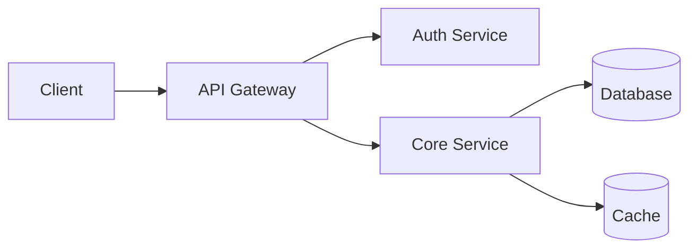
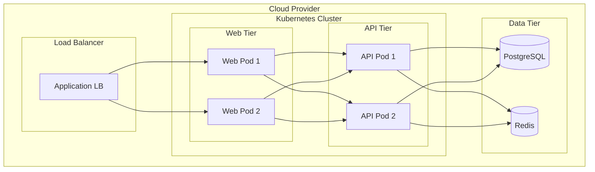

# Architecture Design Generator

## Quick Start

To generate architecture documentation, provide:
1. System name and purpose
2. Key functional requirements
3. Non-functional requirements (performance, security, scalability)
4. Integration points (external systems)
5. Technology constraints (if any)

## Workflow

Copy this checklist and track progress:
```
Architecture Design Progress:
- [ ] Step 1: Understand business context and requirements
- [ ] Step 2: Identify key stakeholders and concerns
- [ ] Step 3: Create C4 Context diagram
- [ ] Step 4: Create C4 Container diagram
- [ ] Step 5: Create C4 Component diagrams (key containers)
- [ ] Step 6: Document data architecture
- [ ] Step 7: Address non-functional requirements
- [ ] Step 8: Create deployment architecture
- [ ] Step 9: Document Architecture Decision Records (ADRs)
- [ ] Step 10: Review and finalize
```

## Output Template

ALWAYS use this exact structure:

```markdown
# Architecture Design Document

**System**: [System Name]
**Version**: 1.0
**Date**: [DATE]
**Author**: [Author]
**Status**: Draft

---

## 1. Introduction

### 1.1 Purpose
This document describes the software architecture for [System Name].

### 1.2 Scope
[What this architecture covers]

### 1.3 Definitions & Acronyms
| Term | Definition |
|------|------------|
| [Term] | [Definition] |

### 1.4 References
| Document | Version | Location |
|----------|---------|----------|
| Requirements Spec | [Ver] | [Link] |
| Product Requirements | [Ver] | [Link] |

---

## 2. Architecture Overview

### 2.1 Business Context
[Brief description of the business problem being solved]

### 2.2 Solution Overview
[High-level description of the solution]

### 2.3 Key Architecture Decisions

| Decision | Rationale | Alternatives Considered |
|----------|-----------|------------------------|
| [Decision 1] | [Why] | [Alternatives] |
| [Decision 2] | [Why] | [Alternatives] |

---

## 3. C4 Model

### 3.1 Level 1: System Context



**Context Description**:
| Element | Description | Technology |
|---------|-------------|------------|
| [System] | [Description] | [Tech] |
| [External 1] | [Description] | [Tech] |

### 3.2 Level 2: Container Diagram



**Container Descriptions**:
| Container | Description | Technology | Responsibilities |
|-----------|-------------|------------|------------------|
| Web App | User interface | React, TypeScript | UI rendering, user interaction |
| API Server | Backend services | FastAPI, Python | Business logic, data access |
| Database | Persistent storage | PostgreSQL | Data persistence |
| Cache | Caching layer | Redis | Session management, caching |

### 3.3 Level 3: Component Diagram



**Component Descriptions**:
| Component | Description | Responsibilities |
|-----------|-------------|------------------|
| Auth Module | Authentication | JWT validation, RBAC |
| User Service | User management | CRUD operations |
| Core Service | Business logic | Domain operations |
| Data Access | Database layer | ORM, queries |

---

## 4. Data Architecture

### 4.1 Data Model



### 4.2 Data Flow



### 4.3 Data Storage

| Data Type | Storage | Retention | Backup |
|-----------|---------|-----------|--------|
| User data | PostgreSQL | Indefinite | Daily |
| Sessions | Redis | 24 hours | None |
| Logs | Elasticsearch | 90 days | Weekly |

---

## 5. Non-Functional Requirements

### 5.1 Performance

| Metric | Target | Measurement |
|--------|--------|-------------|
| Response time (P95) | < 200ms | APM monitoring |
| Throughput | 1000 req/s | Load testing |
| Availability | 99.9% | Uptime monitoring |

### 5.2 Scalability

| Dimension | Strategy |
|-----------|----------|
| Horizontal | Container orchestration (Kubernetes) |
| Vertical | Resource limits per container |
| Data | Read replicas, sharding |

### 5.3 Security

| Control | Implementation |
|---------|----------------|
| Authentication | JWT tokens, OAuth 2.0 |
| Authorization | RBAC with permissions |
| Encryption | TLS 1.3 in transit, AES-256 at rest |
| Audit | All API calls logged |

### 5.4 Reliability

| Aspect | Strategy |
|--------|----------|
| Fault tolerance | Circuit breakers, retries |
| Disaster recovery | Multi-AZ deployment |
| Backup | Daily automated backups |

---

## 6. Deployment Architecture

### 6.1 Deployment Diagram



### 6.2 Environment Configuration

| Environment | Purpose | Scaling | Data |
|-------------|---------|---------|------|
| Development | Dev testing | 1 replica | Synthetic |
| Staging | Pre-prod | 2 replicas | Anonymized |
| Production | Live | Auto-scale | Real |

---

## 7. Integration Architecture

### 7.1 External Integrations

| System | Protocol | Authentication | Purpose |
|--------|----------|----------------|---------|
| [System 1] | REST | API Key | [Purpose] |
| [System 2] | GraphQL | OAuth 2.0 | [Purpose] |

### 7.2 API Design

| Endpoint | Method | Description |
|----------|--------|-------------|
| /api/v1/users | GET | List users |
| /api/v1/users/{id} | GET | Get user |
| /api/v1/users | POST | Create user |

---

## 8. Architecture Decision Records

### ADR-001: [Decision Title]

**Status**: Accepted  
**Date**: [Date]

**Context**: [Why this decision was needed]

**Decision**: [What was decided]

**Consequences**:
- Positive: [Benefits]
- Negative: [Tradeoffs]

---

## 9. Risks & Mitigations

| Risk | Probability | Impact | Mitigation |
|------|-------------|--------|------------|
| [Risk 1] | Medium | High | [Mitigation] |
| [Risk 2] | Low | Medium | [Mitigation] |

---

## 10. Appendices

### A. Technology Stack

| Layer | Technology | Version | Purpose |
|-------|------------|---------|---------|
| Frontend | React | 18.x | UI framework |
| Backend | FastAPI | 0.100+ | API framework |
| Database | PostgreSQL | 15.x | Primary database |
| Cache | Redis | 7.x | Caching |

### B. Glossary

| Term | Definition |
|------|------------|
| [Term] | [Definition] |
```

## References

- **C4 Model**: See [reference/c4-model-guide.md](reference/c4-model-guide.md)
- **NFR Checklist**: See [reference/nfr-checklist.md](reference/nfr-checklist.md)
- **ADR Template**: See [reference/adr-template.md](reference/adr-template.md)
