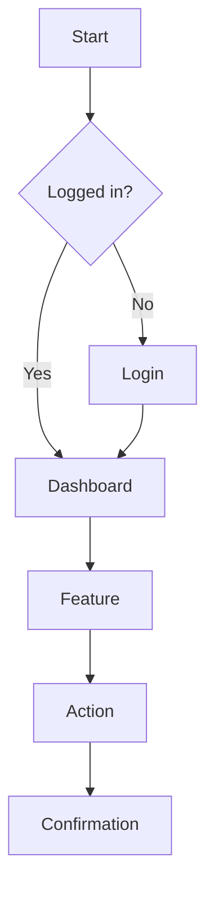

# PRD Writer

## Quick Start

To generate a PRD, provide:
1. Product/feature name
2. Problem being solved
3. Target users
4. Key capabilities needed
5. Success metrics

## Workflow

Copy this checklist and track progress:
```
PRD Writing Progress:
- [ ] Step 1: Define problem statement
- [ ] Step 2: Identify target users and personas
- [ ] Step 3: Define user goals and jobs-to-be-done
- [ ] Step 4: Write user stories with acceptance criteria
- [ ] Step 5: Define success metrics
- [ ] Step 6: Identify dependencies and constraints
- [ ] Step 7: Create wireframes/mockups (if needed)
- [ ] Step 8: Review with stakeholders
```

## Output Template

ALWAYS use this exact structure:

```markdown
# Product Requirements Document

**Product/Feature**: [Name]
**Version**: 1.0
**Date**: [DATE]
**Author**: [Product Manager]
**Status**: Draft

---

## 1. Overview

### 1.1 Problem Statement
[Clear description of the problem being solved]

**Who** has this problem: [Target users]
**What** is the problem: [Problem description]
**Why** it matters: [Business impact]

### 1.2 Solution Summary
[One paragraph describing the proposed solution]

### 1.3 Goals
| Goal | Description | Metric |
|------|-------------|--------|
| G1 | [Goal 1] | [How measured] |
| G2 | [Goal 2] | [How measured] |

### 1.4 Non-Goals
- [What this feature will NOT do]
- [Explicitly out of scope]

---

## 2. User Personas

### 2.1 Primary Persona: [Name]

**Role**: [Job title/role]
**Goals**: [What they want to achieve]
**Pain Points**: [Current frustrations]
**Tech Savviness**: [Low/Medium/High]

### 2.2 Secondary Persona: [Name]

**Role**: [Job title/role]
**Goals**: [What they want to achieve]

---

## 3. User Stories

### 3.1 Epic: [Epic Name]

#### US-001: [User Story Title]

**As a** [persona]
**I want to** [action]
**So that** [benefit]

**Acceptance Criteria**:
```gherkin
Given [precondition]
When [action]
Then [expected result]

Given [precondition]
When [action]
Then [expected result]
```

**Priority**: High/Medium/Low
**Story Points**: [Estimate]
**Dependencies**: [US-XXX]

---

#### US-002: [User Story Title]

**As a** [persona]
**I want to** [action]
**So that** [benefit]

**Acceptance Criteria**:
```gherkin
Given [precondition]
When [action]
Then [expected result]
```

**Priority**: High/Medium/Low
**Story Points**: [Estimate]

---

## 4. Functional Requirements

### 4.1 [Feature Area 1]

| ID | Requirement | Priority | Notes |
|----|-------------|----------|-------|
| FR-001 | [Requirement] | Must Have | |
| FR-002 | [Requirement] | Should Have | |
| FR-003 | [Requirement] | Could Have | |

### 4.2 [Feature Area 2]

| ID | Requirement | Priority | Notes |
|----|-------------|----------|-------|
| FR-004 | [Requirement] | Must Have | |

---

## 5. Non-Functional Requirements

| ID | Category | Requirement | Target |
|----|----------|-------------|--------|
| NFR-001 | Performance | Page load time | < 2 seconds |
| NFR-002 | Availability | Uptime | 99.9% |
| NFR-003 | Security | Authentication | OAuth 2.0 |
| NFR-004 | Accessibility | WCAG compliance | Level AA |

---

## 6. User Experience

### 6.1 User Flow



### 6.2 Wireframes
[Link to wireframes or embed images]

### 6.3 UI Requirements
- [UI requirement 1]
- [UI requirement 2]

---

## 7. Success Metrics

### 7.1 Key Performance Indicators

| Metric | Current | Target | Measurement |
|--------|---------|--------|-------------|
| [Metric 1] | [Baseline] | [Target] | [How measured] |
| [Metric 2] | [Baseline] | [Target] | [How measured] |

### 7.2 Success Criteria
- [ ] [Criterion 1]
- [ ] [Criterion 2]

---

## 8. Dependencies & Constraints

### 8.1 Dependencies
| Dependency | Type | Owner | Status |
|------------|------|-------|--------|
| [Dependency 1] | Technical | [Team] | [Status] |
| [Dependency 2] | External | [Vendor] | [Status] |

### 8.2 Constraints
- [Constraint 1]
- [Constraint 2]

### 8.3 Assumptions
- [Assumption 1]
- [Assumption 2]

---

## 9. Risks

| Risk | Probability | Impact | Mitigation |
|------|-------------|--------|------------|
| [Risk 1] | High/Med/Low | High/Med/Low | [Mitigation] |

---

## 10. Timeline

### 10.1 Release Plan

| Phase | Scope | Target Date |
|-------|-------|-------------|
| MVP | [Core features] | [Date] |
| V1.1 | [Additional features] | [Date] |
| V2.0 | [Future enhancements] | [Date] |

### 10.2 Sprint Allocation
| Sprint | User Stories | Points |
|--------|--------------|--------|
| Sprint 1 | US-001, US-002 | [X] |
| Sprint 2 | US-003, US-004 | [X] |

---

## 11. Open Questions

| Question | Owner | Due Date | Resolution |
|----------|-------|----------|------------|
| [Question 1] | [Owner] | [Date] | [Pending/Resolved] |

---

## 12. Appendix

### A. Glossary
| Term | Definition |
|------|------------|
| [Term] | [Definition] |

### B. References
- [Reference 1]
- [Reference 2]
```

## References

- **User Story Template**: See [reference/user-story-guide.md](reference/user-story-guide.md)
- **Acceptance Criteria Guide**: See [reference/acceptance-criteria.md](reference/acceptance-criteria.md)
- **Prioritization Frameworks**: See [reference/prioritization.md](reference/prioritization.md)
